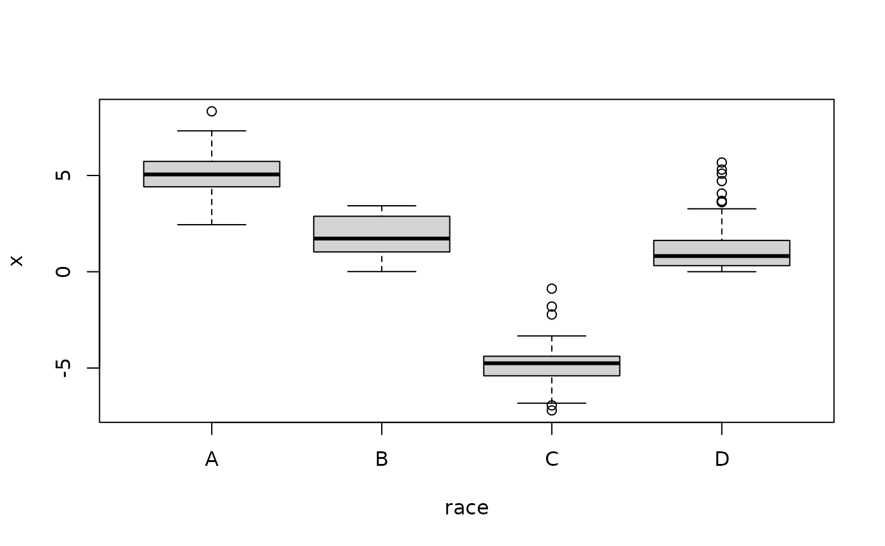

# The 'ABCs' of \`lmabc\`: linear regression with categorical covariates

## Overview

Regression analysis commonly features categorical (or nominal)
covariates, such as race, sex, group/experimental assignments, and many
other examples. These variables may appear alongside other covariates,
as in the *main-only* (or ANCOVA) model

`y ~ x + race`

or interacted with other variables, as in the *cat-modified* model

`y ~ x + race + x:race`

(here we use `race` as our default categorical variable for clarity).

The cat-modified model estimates group-specific effects of `x` on the
response `y` (e.g., does exposure to a pollutant `x` more adversely
impact the health `y` of certain subpopulations?). Specifically, the
linear model expresses the expectation of the response variable `y` at
given `x` and `race` values:
$$E\left( Y|X = x,race = r \right) = \mu(x,r) = \alpha_{0} + \alpha_{1}x + \beta_{r} + \gamma_{r}x$$
(here `x` is continuous). As a result, we obtain *group-specific
intercepts*, $$\mu(0,r) = \alpha_{0} + \beta_{r}$$ and *group-specific
slopes*, $$\mu(x + 1,r) - \mu(x,r) = \alpha_{1} + \gamma_{r}.$$ The
main-only model is recovered when $\gamma_{r} = 0$ for all `race` groups
$r$. Then the slope is global and does not depend on `race`:
$\mu(x + 1,r) - \mu(x,r) = \alpha_{1}$.

However, both the main-only and the cat-modified models have too many
parameters. This is known as the “dummy variable trap”: to numerically
encode $L$ levels of a categorical variable, only $L - 1$ dummy
variables are needed. Here, both models have group-specific intercepts,
yet these are parametrized by group-specific coefficients
$\beta_{r}$*and* a global coefficient $\alpha_{0}$. Clearly, this uses
one more parameter than necessary. A similar problem occurs for
group-specific slopes. Without modification, these parameters are not
estimable or interpretable.

The central question is then, how best to parametrize (or constrain)
these group-specific intercepts and slopes? The choice has significant
implications for **statistical efficiency**, **equitability**, and
**interpretability**.

## Example Dataset

We generate a simulated dataset with a continuous response variable `y`,
a continuous covariate `x`, and two categorical variables, `race` and
`sex`.

To mimic the challenges of real data analysis, the simulated covariates
are *dependent*: `x` depends on `race`, both in mean and distribution,



while `race` and `sex` are highly dependent categorical variables:

|     |     A |     B |     C |     D |
|:----|------:|------:|------:|------:|
| uu  | 0.292 | 0.126 | 0.058 | 0.078 |
| vv  | 0.056 | 0.028 | 0.104 | 0.258 |

Simulated data proportions: sex (rows) and race (columns)

We will consider estimation and inference with various combinations of
the predictors `x`, `race`, and `sex` (and their interactions). The
`race` and `sex` variables use arbitrary labeling to avoid any
misleading race- or sex-specific effects in our example regression
output.

## Default strategies: the problem

Suppose we call `lm` to fit the cat-modified model:

``` r
fit_lm = lm(y ~ x + race + x:race)
```

The [`summary()`](https://rdrr.io/r/base/summary.html) output appears as
follows:

|             | Estimate | Std. Error | t value | Pr(\>\|t\|) |
|:------------|---------:|-----------:|--------:|------------:|
| (Intercept) |     1.95 |       0.35 |    5.62 |        0.00 |
| x           |     1.51 |       0.07 |   22.40 |        0.00 |
| raceB       |    -1.27 |       0.41 |   -3.14 |        0.00 |
| raceC       |    -2.36 |       0.60 |   -3.94 |        0.00 |
| raceD       |    -0.96 |       0.36 |   -2.64 |        0.01 |
| x:raceB     |    -0.86 |       0.12 |   -7.17 |        0.00 |
| x:raceC     |    -0.59 |       0.12 |   -4.93 |        0.00 |
| x:raceD     |    -0.56 |       0.09 |   -6.02 |        0.00 |

Default output: lm(y ~ x + race + x:race)

Immediately, we notice the absence of `raceA` and `x:raceA`. This occurs
by design: `lm` uses *reference group encoding* (RGE), which
parametrizes the model by deleting a reference group, here
$\beta_{A} = 0$ and $\gamma_{A} = 0$. There are several limitations of
this approach.

First, the `x` effect is *misleading*: because $\gamma_{A} = 0$, the
“global” slope parameter is
$$\alpha_{1} = \alpha_{1} + \gamma_{A} = \mu(x + 1,A) - \mu(x,A),$$
i.e., the group-specific `x` effect *for the reference group*
(`race = A`). However, this is not clear from the model output, which
instead appears to present a “global” `x` effect. This presentation
invites mistaken conclusions about the `x` effect for the broader
population.

Second, this output is *inequitable*: it elevates one group above all
others. The reference group is often selected to be White for `race`,
Male for `sex`, etc., and thus induces a bias in the presentation of
results. Similarly, the `x:race` effects are presented as deviations
from the reference group `x` effect: for example `x:raceB` refers to the
difference between the `x` effect for group `B` and the `x` effect for
the reference group `A`. This implicitly treats one group as “normal”
and the others as “deviations from normal.”

Third, RGE is not well-designed to include interactions like `x:race`.
In addition to the difficulties with interpretations and equitability,
RGE is *statistically inefficient* for the main effects. To see this,
consider the estimates and inference for the `x` effect under the
main-only model `y ~ x + race`:

|     | Estimate | Std. Error | t value | Pr(\>\|t\|) |
|:----|---------:|-----------:|--------:|------------:|
| x   |     1.08 |       0.04 |   26.39 |           0 |

Estimated x effect: lm(y ~ x + race)

The estimates and standard errors of the `x` effect are considerably
different. This occurs because here, the `x` effect refers to a global
slope, $\alpha_{1} = \mu(x + 1,r) - \mu(x,r)$, rather than a (reference)
group-specific slope—even though the output appears exactly the same.
Usually, the standard errors will *increase* when `x:race` is included,
since the slope is restricted to a subset of the data.

In aggregate, default `lm` output under RGE is at best difficult to
interpret and at worst outright misleading. It suffers from alarming
inequities and sacrifices statistical efficiency in the presence of
(`x:race`) interactions. These issues also occur for the intercept
parameters and compound for multiple categorical variables and
interactions.

## Abundance-Based Constraints (ABCs): the solution

Instead, suppose we call `lmabc` to fit the cat-modified model:

``` r
library(lmabc)
fit_lmabc = lmabc(y ~ x + race + x:race)
```

The [`summary()`](https://rdrr.io/r/base/summary.html) output appears as
follows:

|             | Estimate | Std. Error | t value | Pr(\>\|t\|) |
|:------------|---------:|-----------:|--------:|------------:|
| (Intercept) |     2.85 |       0.14 |   20.71 |        0.00 |
| x           |     1.09 |       0.04 |   28.23 |        0.00 |
| raceA       |     1.58 |       0.19 |    8.28 |        0.00 |
| raceB       |    -1.10 |       0.16 |   -6.71 |        0.00 |
| raceC       |    -1.74 |       0.55 |   -3.18 |        0.00 |
| raceD       |    -0.29 |       0.14 |   -2.03 |        0.04 |
| x:raceA     |     0.42 |       0.05 |    7.74 |        0.00 |
| x:raceB     |    -0.44 |       0.09 |   -4.86 |        0.00 |
| x:raceC     |    -0.18 |       0.09 |   -1.94 |        0.05 |
| x:raceD     |    -0.14 |       0.05 |   -2.70 |        0.01 |

ABC output: lmabc(y ~ x + race + x:race)

First, every `race` group is represented: the results do *not* elevate
any single `race` group above the others. This eliminates the
presentation bias and provides more **equitable** output.

Second, the `x` effect estimates and standard errors are *nearly
identical* to those in the main-only model (${\widehat{\alpha}}_{1} =$
1.08, $SE\left( {\widehat{\alpha}}_{1} \right) =$ 0.04). This
illustrates two remarkable **invariance properties of ABCs**:

1.  The estimated `x` effects under `y ~ x + race` and
    `y ~ x + race + x:race` are nearly identical; and  
2.  The standard errors of the `x` effects under `y ~ x + race` and
    `y ~ x + race + x:race` are
    1.  Nearly identical when the `x:race` effect is small or
    2.  Smaller for the cat-modified model when the `x:race` effect is
        large.

In effect, ABCs allow the inclusion of (`x:race`) interactions “for
free”: they have (almost) no impact on estimation and inference for the
main `x` effect. With ABCs, the analyst can estimate group-specific `x`
effects without worrying that the addition of `x:race` will sacrifice
power for the main `x` effect (which occurs for RGE). And, when the
interaction effect `x:race` is substantial, the analyst gains *more
power* for the main `x` effect.

We emphasize several features of these invariance properties:

- They are unique to ABCs and do *not* occur for alternative approaches
  (default RGE, sum-to-zero constraints, etc.);
- They make no requirements about the true data-generating process; and
- They allow for dependencies between `x` and `race` (as in this
  simulated dataset).

The only condition is that, for continuous `x`, the scale of `x` must be
approximately the same within each `race` group (no conditions are
needed when `x` is categorical; see below). This is reasonable: if a
“one-unit change in `x`” is not comparable for different `race` groups,
then only the cat-modified model that includes `race`-specific slopes is
meaningful. In that case, there is no reason to consider the `x` effect
under the main-only model. Empirically, these (near) invariance results
are quite robust to this condition.

Finally, these results improve **interpretability**: all group-specific
coefficients $\gamma_{r}$ (e.g., `x:raceB`) now represent the difference
between the group-specific slope, $\mu(x + 1,r) - \mu(x,r)$, and the
*properly global* `x` effect $\alpha_{1}$. Similar interpretations apply
to the intercept parameters.

### ABCs: some details

ABCs identify the group-specific parameters by constraining the *group
averages* to be zero,
$$E_{\pi}\left( \gamma_{R} \right) = \sum\limits_{r}\pi_{r}\gamma_{r} = 0$$
where $R$ denotes a categorical random variable (e.g., `race`) with
probabilities $Pr(R = r) = \pi_{r}$. A similar constraint is then used
for the group-specific intercept parameters:
$E_{\pi}\left( \beta_{R} \right) = \sum_{r}\pi_{r}\beta_{r} = 0$. These
linear constraints are constructed using
[`getConstraints()`](https://drkowal.github.io/lmabc/reference/getConstraints.md)
and enforced during estimation, for example using ordinary least squares
[`lmabc()`](https://drkowal.github.io/lmabc/reference/lmabc.md), maximum
likelihood
[`glmabc()`](https://drkowal.github.io/lmabc/reference/glmabc.md), and
penalized least squares
[`cv.penlmabc()`](https://drkowal.github.io/lmabc/reference/cv.penlmabc.md).
Modifications are available for categorical-categorical interactions.

The constraints above are general and include many special cases: RGE
uses $\pi_{A} = 1$ (reference) and $\pi_{r} = 0$ otherwise, while
sum-to-zero constraints use equal weights $\pi_{r} = 1$ for all $r$.
However, *the choice of $\{\pi_{r}\}$ is critical for equitability,
statistical efficiency, and interpretability.*

ABCs use the empirically-observed proportions by group,
$\pi_{r} =$`mean(race == r)`. As such, the parameters have a genuine
“group-average” interpretation. For instance, the global slope parameter
in the cat-modified model is
$$\alpha_{1} = E_{\pi}\{\mu(x + 1,R) - \mu(x,R)\} = \sum\limits_{r}\pi_{r}\{\mu(x + 1,r) - \mu(x,r)\}$$
i.e., the group average of the group-specific `x` effects. Similar
interpretations are available for the global intercept:
$$\alpha_{0} = E_{\pi}\{\mu(0,R)\} = \sum\limits_{r}\pi_{r}\mu(0,r).$$
Because ABCs identify properly global (intercept and slope) parameters,
the group-specific coefficients are interpretable as the difference
between the group-specific `x` effect (or intercept) and the
global/group-averaged `x` effect (or intercept). There is no need to
elevate any single (reference) group.

ABCs may also use the population group proportions, if those are known
and passed to the function.

### Interpeting the `lmabc` output

Revisiting the output from `lmabc(y ~ x + race + x:race)`, we summarize
the main conclusions:

- The global `x` effect is significant and positive
  (${\widehat{\alpha}}_{1} = 1.09$,
  $SE\left( {\widehat{\alpha}}_{1} \right) = 0.04$).
- The `x:race` interaction effects show that the group-specific `x`
  effect is significantly larger than average for `race = A`
  (${\widehat{\gamma}}_{A} = 0.42$,
  $SE\left( {\widehat{\gamma}}_{A} \right) = 0.05$), significantly
  smaller than average for `race = B`
  (${\widehat{\gamma}}_{B} = - 0.44$,
  $SE\left( {\widehat{\gamma}}_{B} \right) = 0.09$) and `race = D`
  (${\widehat{\gamma}}_{D} = - 0.14$,
  $SE\left( {\widehat{\gamma}}_{D} \right) = 0.05$), and somewhat
  smaller than average for `race = C`
  (${\widehat{\gamma}}_{C} = - 0.18$,
  $SE\left( {\widehat{\gamma}}_{C} \right) = 0.09$).
- The group-specific slopes are computed by summing the relevant
  coefficients, for example
  $\mu(x + 1,A) - \mu(x,A) = \alpha_{1} + \gamma_{A} = 1.51$ is the
  group-specific `x` effect for `race = A`.
- Similar interpretations apply for the intercept coefficients.

## Categorical-categorical interactions

The case of categorical-categorical interactions is arguably even more
cumbersome for default (RGE) methods—and yet ABCs offer an even cleaner
solution. Consider the `lm` output for two models that feature the
categorical covariates `race` and `sex`: the main-only model
`y ~ race + sex` and the cat-modified model,
`y ~ race + sex + race:sex`.

[TABLE]

In both cases, the reference groups for `race` (here, `A`) and `sex`
(here, `uu`) are absent from all main and interaction effects. The
output again is misleading: even for the simpler model `y ~ race + sex`,
the main effects require consideration of *both* reference groups. For
example, the intercept estimates $\alpha_{0} = \mu(race = A,sex = uu)$,
i.e., the expected response for `race = A` and `sex = uu`. Similarly,
the main effects such as `sexvv` estimate
$\mu(race = A,sex = vv) - \mu(race = A,sex = uu)$, i.e., the difference
in the expected responses between `sex = vv` and `sex = uu` but *only
for `race = A`*. When the reference groups are set at the usual values
(White for `race` and Male for `sex`), these parametrizations are
clearly inequitable. Finally, we see that the standard errors for the
main effects increase when the `race:sex` interaction is added to to the
model.

ABCs completely circumvent these issues. Consider the same two models,
but now subject to ABCs:

[TABLE]

First, each group is present in both the main effects and interactions.
There is no need to consider reference groups, and thus no single
(`race` or `sex`) group is elevated above the others.

Second, *all* main effect estimates—including the `(Intercept)`, all
`race` effects, and both `sex` effects—are *identical* between the
models that do and do not include the `race:sex` interaction. Unlike the
previous setting with continuous-categorical interactions (`x:race`),
this estimation invariance is *exact*. Importantly, this result makes no
requirements on the true data-generating process or the categorical
covariates, which here are highly dependent.

Similarly, the main effect standard errors—again for the `(Intercept)`,
all `race` effects, and both `sex` effects—are (almost) identical
between the two models.

We summarize these (provable) **invariance properties of ABCs** for
categorical-categorical interactions:

1.  The estimated `(Intercept)`, `race`, and `sex` effects under
    `y ~ race + sex` and `y ~ race + sex + race:sex` are identical;
    and  
2.  The standard errors of `(Intercept)`, `race`, and `sex` under
    `y ~ race + sex` and `y ~ race + sex + race:sex` are
    1.  Nearly identical when the `race:sex` effect is small or
    2.  Smaller for the cat-modified model when the `race:sex` effect is
        large.

Again, the analyst may include (`race:sex`) interaction effects “for
free”: the main effect estimates are unchanged, and the statistical
power for the main effects can only increase. Thus, we require that all
main effects are included for any categorical-categorical or
categorical-continuous interactions.

## Interpreting ABCs with care

By design, ABCs leverage the (sample or population) categorical
proportions to provide 1) more equitable output, 2) greater statistical
efficiency, and 3) more interpretable parameters and estimates with
properly global (i.e., group-averaged) main effects. However, the
*group-specific* coefficients must be interpreted carefully in the
context of the abundances $\{\pi_{r}\}$.

For instance, consider the simple model `y ~ sex`,

|             | Estimate | Std. Error | t value | Pr(\>\|t\|) |
|:------------|---------:|-----------:|--------:|------------:|
| (Intercept) |     3.54 |       0.22 |   16.22 |           0 |
| sexuu       |     1.73 |       0.20 |    8.84 |           0 |
| sexvv       |    -2.15 |       0.24 |   -8.84 |           0 |

ABC output: lmabc(y ~ sex)

With two groups, ABCs imply that one effect must be positive and the
other must be negative, as the two must average to zero. These effects
are partly determined by the group abundances, `mean(sex=="uu")` = 0.55
and `mean(sex=="vv")` = 0.45. Because `vv` has a *lower* proportion, its
estimated coefficient must be *higher* (in absolute value) to satisfy
ABCs. Thus, we cannot merely interpret the `vv` effect as “larger than”
the `uu` effect.

Fortunately, the standard errors inflate proportionally: hence, the
`t value` statistics (`Estimate / Std. Error`) are equal and opposite.
Similarly, the p-values will be identical for these (`sexuu` and
`sexvv`) main effects.

Even with these caveats, ABCs offer an appealing parametrization of this
ANOVA model. First, the estimated intercept *exactly* equals the sample
mean, `mean(y)` = 3.54. Second, the `sex`-specific coefficients
*exactly* equal the difference between the group-specific means and the
overall mean, `mean(y[sex=="uu"]) - mean(y)` = 1.73. This is certainly a
natural way to parametrize the group-specific and global effects for
this model.

## Additional details about `lmabc`

The `lmabc` package includes implementations for many common methods:
`summary`, `coef`, `print`, `plot`, `predict`, `logLik`, `vcov`, and
more.

`lmabc` also includes methods for generalized linear models (GLMs) with
categorical covariates (`glmabc`) and penalized (lasso and ridge)
regression with cross-validation (`cv.penlmabc`). These methods, like
`lmabc`, can handle multiple continuous and categorical covariates and
their interactions. We note a few points:

- The invariance properties of ABCs remain valid for multiple continuous
  and categorical covariates and their interactions. The conditions
  change slightly (see the reference below) but approximate invariance
  applies quite generally.
- For GLMs (`glmabc`), ABCs offer equitability and interpretability, but
  estimation invariance applies only for OLS. This work is currently
  under development.
- For penalized (ridge or lasso) regression, ABCs are immensely
  valuable. Because these penalized estimators “shrink” the coefficients
  toward zero, default RGE estimates of group-specific effects are
  *statistically biased toward the reference group*. This is especially
  concerning for protected groups (race, sex, religion, etc.) but also
  implies that 1) estimates and predictions depend on the choice of
  reference group and 2) differences between group-specific `x` effects
  and reference group `x` effects are attenuated and obscured. ABCs
  resolve these critical limitations, again by providing efficient
  estimation and shrinkage toward *properly global* coefficients. The
  statistical properties of these estimators are currently under
  development.

## References

Kowal, D. (2024). Facilitating heterogeneous effect estimation via
statistically efficient categorical modifiers.
<https://arxiv.org/abs/2408.00618>

Kowal, D. (2024). Regression with race-modifiers: towards equity and
interpretability. <https://doi.org/10.1101/2024.01.04.23300033>
